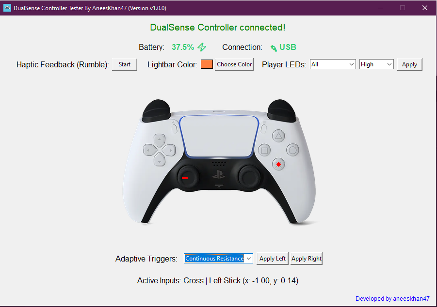

# DualSense Controller Tester

A GUI application for testing out PlayStation 5 DualSense controllers on PC.

## Requirements

- Windows 10/11
- DualSense controller

## Features

- Real-time button input visualization
- Analog stick position tracking
- Controller configuration:
  - Adaptive triggers with multiple effects
  - Lightbar color customization
  - Player LEDs control with brightness settings
  - Haptic feedback (Rumble) testing
- Battery monitoring with charging status
- USB connection status
- Clean and intuitive interface

## Download

1. Go to the [Releases](https://github.com/aneeskhan47/DualSense-Controller-Tester/releases) page
2. Download the latest version's executable file
3. Run the application - no installation required!

## Usage

1. Connect your DualSense controller via USB or Bluetooth
2. Launch the application
3. Test different features:
   - Press buttons to see visual feedback
   - Move analog sticks to track position
   - Test adaptive triggers with different effects
   - Customize lightbar color
   - Configure player LEDs
   - Try haptic feedback
4. Disconnect controller to reset all changes

## Credits

- [dualsense-controller-python](https://github.com/yesbotics/dualsense-controller-python) - Python library for DualSense controllers
- [tkinter](https://docs.python.org/3/library/tk.html) - Python GUI framework
- [PIL](https://pillow.readthedocs.io/en/stable/) - Python Imaging Library
- [pyinstaller](https://pyinstaller.readthedocs.io/en/stable/) - Python application packaging tool
## License

This project is licensed under the MIT License - see the [LICENSE](LICENSE) file for details.

